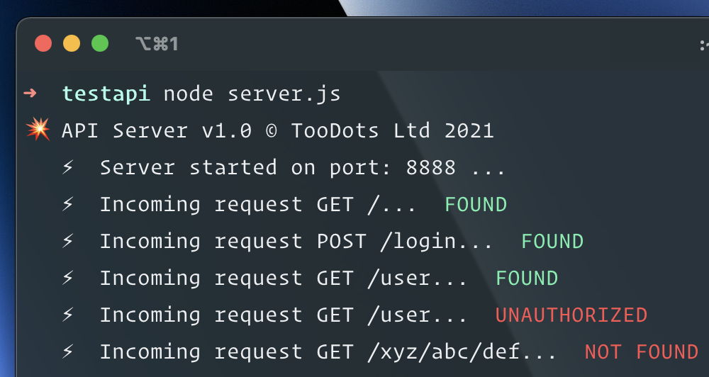

# QUICK API TEST SERVER

Fast and simple zero dependencies NodeJS API server.

## How to start?

- Change your current path to this folder.
- Execute `node server.js`
- API is now available at http://localhost:8888

## Routing

All routes can be edited in `routes.js` file.
Responses are generated in controllers placed in `src/controllers`.

## Copyright

Copyright © 2021 TooDots Ltd. All rights reserved.
